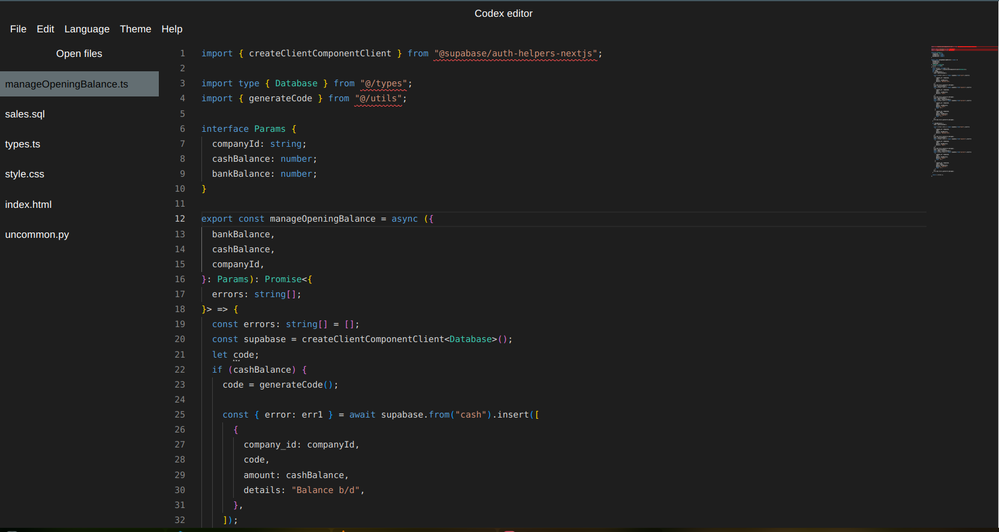

# Codex custom code editor
## Getting Started

First, run the development server:

```bash
npm run dev
# or
yarn dev
# or
pnpm dev
```
## Tech-stack
- NextJs
- Typescript
- Material UI
- Monaco editor package
- Zustand

## Demo

